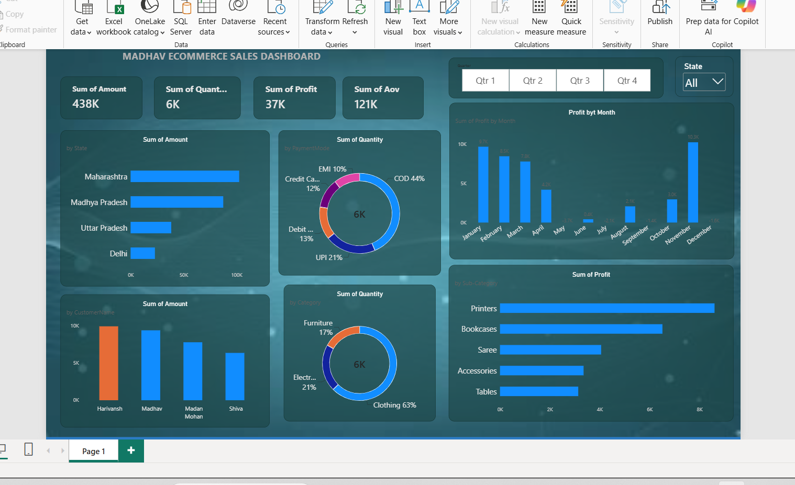

# Madhav E-Commerce Sales Analysis Dashboard

An interactive e-commerce sales analysis dashboard built using Microsoft Power BI.

## Dashboard

## Key Metrics

- Total Sales: ₹438K
- Total Quantity Sold: 6K+
- Total Profit: ₹37K
- Average Order Value: ₹121K

## Analysis

The dashboard provides insights into:

- State-wise sales and profit
- Category-wise performance
- Monthly sales and profit trends
- Payment method distribution
- Top customers
- Quantity sold by category
- Quarterly performance

## Tools & Technologies

- Microsoft Power BI
- Power Query
- DAX
- Data Visualization

## Project Workflow

1. Imported the e-commerce dataset into Power BI
2. Cleaned and transformed the data using Power Query
3. Created calculated measures using DAX
4. Built interactive visualizations and KPI cards
5. Added filters for quarter and state
6. Analyzed sales and profitability across different dimensions

## Project Files

The `.pbix` Power BI project file is included in this repository.
